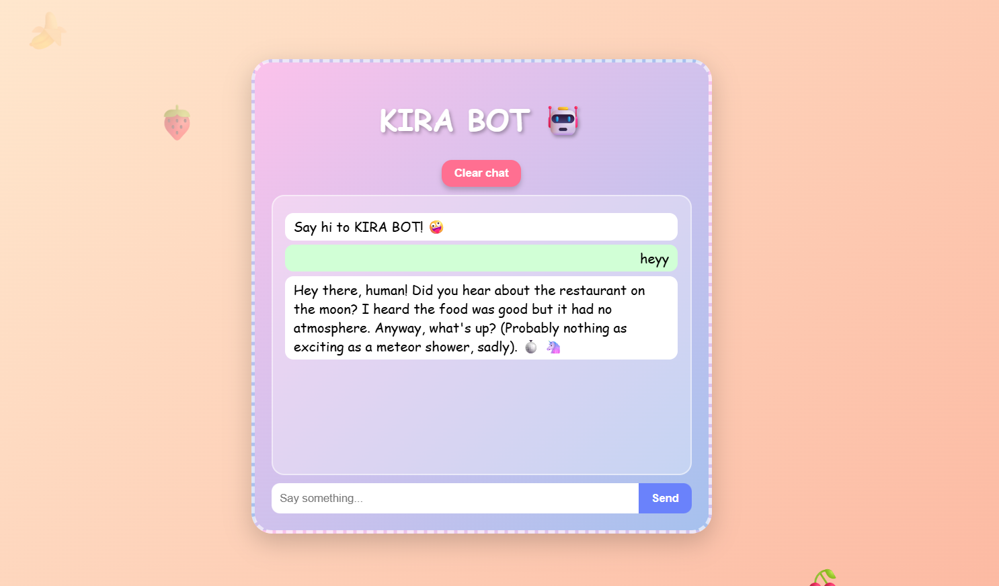

# TalkWithVoid 🎯

## Basic Details
### Team Name: GOKU

### Team Members
- Team Lead: sreyas - cucek
- Member 2: gopika - cucek

### Project Description

Chaotic SnarkBot is a ridiculous chatbot that replies in an unserious, sarcastic tone with random emojis. It can detect distress in a message and temporarily switch to being wholesome and supportive.

### The Problem (that doesn't exist)
Serious AI assistants are boring — they either give you textbook answers or pretend to be your therapist. Where’s the chaos? Where’s the sarcasm?

### The Solution (that nobody asked for)
We built an AI chatbot that talks like it’s had too much coffee, sprinkles random emojis everywhere, and sometimes thinks it’s a potato. But if you seem sad, it drops the jokes and offers support.

## Technical Details
### Technologies/Components Used
For Software:
For Software:

Languages: JavaScript, HTML, CSS

Frameworks: None (vanilla frontend)

Libraries: None (custom JS + Fetch API)

Tools: Netlify (hosting), OpenRouter API (DeepSeek model), VS Code, GitHub

For Hardware:
Laptop (capable of running a browser)

Internet connection (preferably chaotic Wi-Fi)

Coffee mug for debugging motivation

### Implementation
For Software:
# Installation
[commands]

# Run
[commands]

### Project Documentation
For Software:

# Screenshots (Add at least 3)

*Add caption explaining what this shows*

*Add caption explaining what this shows*

*Add caption explaining what this shows*

# Build Photos

*Explain the build steps*

*Explain the final build*

### Project Demo
# Video

# Additional Demos
[Add any extra demo materials/links]

## Team Contributions
- [Name 1]: Sreyas S
- [Name 2]: Gopika K

---
Made with ❤️ at TinkerHub Useless Projects 

